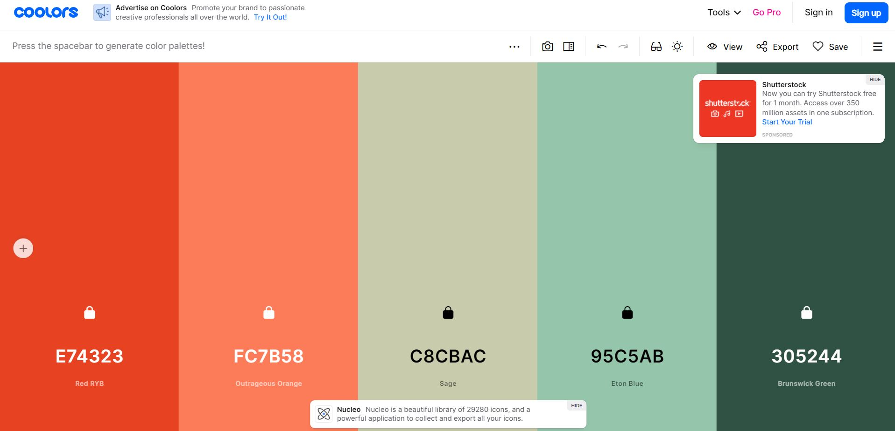
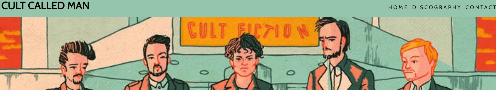
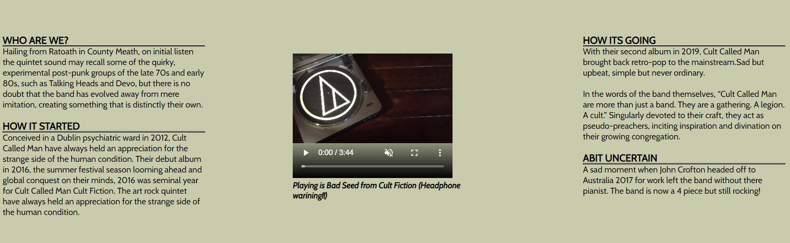
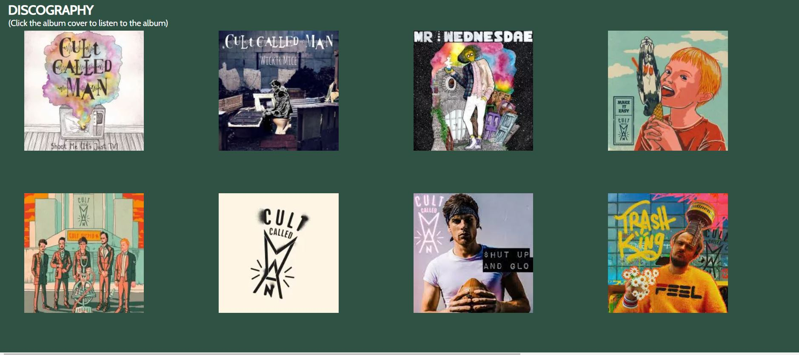
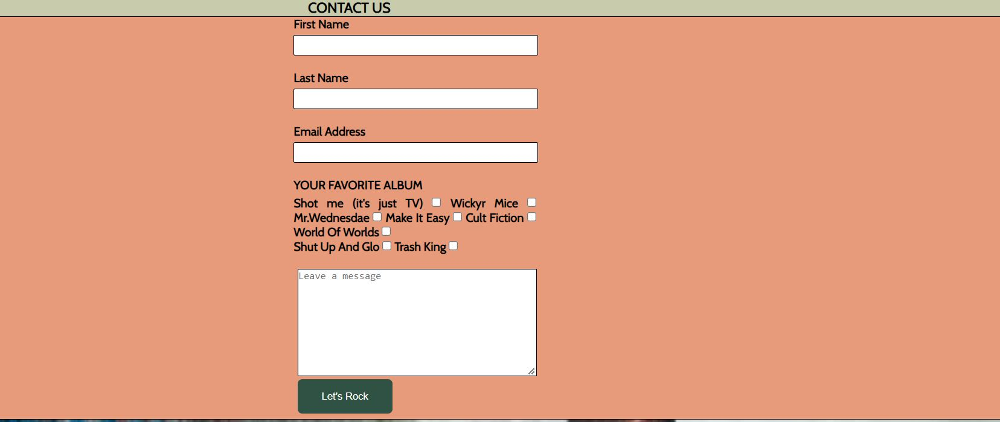
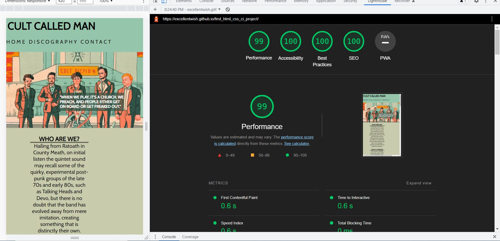
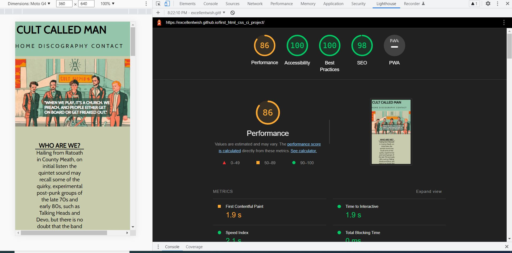

# Cult Called Man
My website [live here](https://excellentwish.github.io/first_html_css_ci_project/)

## Project Portfolio 1- HTML and CSS Essentials - Code Institute.
### Site Overview

The project will cover  my favorite music group.
Its aim is to highlight there music and social media presence.
The idea of the project is to showcase there music to fans and newbies while making it as user friendly as I can.
Cult Called Man an Irish retro pop rock group from Co.Meath Ireland and have a very unique sound fo them that is upbeat and melencholy.
 I want to have a place were fans and newbies can get all of the bands music in one place as they are found on different websites online. I want to tell people of my favorite Irish band and let them listen to them and if they wanted they can contact them.

# Table of Contents
+ [Site Overview](#site-overview)
+ [Planning stage](#planning-stage)
+ [Whats on the table?](#whats-on-the-table?)
+ [The Actual website](#The-Actual-website)
+ [Tech used](#tech-used)
+ [Testing](#testing)
+ [Deployment](#deployment)
+ [Credits](#credits)

   
# Planning stage
### Target Audiences:
* Users looking for new music from Ireland.
* Users with a general interest in Cult Called Man and want to learn more.
* Users who have never heard of Cult Called Man.
* Users who have heard of Cult Called Man but would like to find more information.

## User Experience
* As a site user, I want to be able to easily navigate through the site and find the information I am looking for. 
* As a site user, I want to be able to view the site on all my devices.
* As a site user, I want to be satisfied with the information provided.
* As a site user, I want to be able to find contact information.
* As a site user, I want to be able to find social media links easily.

## Site Aims:
* To educate the user on Cult Called Man's music.
* To offer the user a chance to listen to the band.
* To offer the user a way to contact the site author for further information or discussion.
* To offer a way to analyse which album is fans favorite.

## How Is This Will Be Achieved:
* The index page provides the user with a summary of the band, with a way to listen to the bands music and a way to contact them. I will also include a check box to find out which is there most popular album.

* The site will provide free ways to listen to there music with links to there bandcamp and spotify so users can listen to their music.

* The site will have information on the type of band this is and genre of music they play. It will have their music playing on the website with a video.

* The site will have links to their social media platforms

* The site will have a contact us form were users can find more information on the band.

## Wireframes
To organize my thoughts and prevent scope creep, I created wireframes for this project. Below are links to each of the mobile and desktop versions.

  Desktop
 * [Index html](docs/wireframes/index-wireframe.JPG)
 * [Discography html](docs/wireframes/discography-wireframe.JPG)
 * [Contact html](docs/wireframes/contact-us-wireframe.JPG)

 Mobile
 * [Overview](docs/wireframes/mobile-overview.JPG)
 * [Index](docs/wireframes/moblie-home.JPG)
 * [Discography](docs/wireframes/mobile-discography.JPG)
 * [Contact and footer](docs/wireframes/contact-footer-mobile.JPG)
 
 Color Scheme
 We want a familiarity for the user and fans. Using the color scheme from there album Cult Fiction we can create that familiarity. They are bright colors and have the users accessibility in mind. 

# Whats on the table?

**The header element** sticks to the top of the page as the user scrolls up and down. It contains the navigation links and sticky header would provide a more pleasant UX and adhere to popular conventions better.

**The navigation** will be in the header, having both the the band name and a home button in the header seem to be the industry standard.

**The Cult theme** Is like the hero image in lover running. This will also give the general theme of the website to the user as it is bright colors that contrast with each other. Its from there album Cult ficiton as it has bright contrasting colors and will provide accessablilty to the users.

**The information** on the page is found through the internet from interviews the band had with https://www.breakingtunes.com/cultcalledman and from https://www.postpravdamagazine.com/four-up-coming-irish-acts/?fbclid=IwAR2zmFfPo2vifrUows6bTzwNSGFj-Qgi_5f-ouU0TpY5MJuAkj4jMvGe0FA.

**The Video** is from there youtube channel. The song is from the same album and the song is called Bad seeds. It will be  muted and autoplay will be off, so that we dont irritate the users and also provide a headphone warning before playing. As this is a rock band website it is probably more important to be carefull with users hearing.

**Discography** will be located under the main infromation of the page will link all of the band music from other websites into one easy to mange place.Using anchor tags to link to there bandcamp website and there spotify. It will let the user click and have the bands music avaliable to them. I will be using the bands bandcamp website and Spotify so we can bring all of there music to 1 website.

**Contact** will be an easy to use form people can use if they have questions for the band and I can also include a way to analyse what the fans favorite songs were to find out which of there albums is doing the best.

**Footer** will include there social media links and an all right reserved section for the website.

**Typography** used will be cabin as I think it fits the style of the band, and also san-serif for not compatiable browsers.

# The Actual website
I want to achieve an easy and convient place for people to find all of the bands music and information. I want to tell people of there music by having a discography. I want a brief summary of the band and I want a way to contact them.

Lets start with the header.

This **header** has the navigation and title of the website. Also we have the album Cult Fiction as our hero image. Like in Code Institute love running project. 
We can see the bright colors from the album being used in the website.
I had used 3 html pages but found that the was not enough content to fill 3 separate pages, so I split the pages into 3 sections for the user.

Next we the **information section** of the web page. This has some basic information on the type of music they play and a brief introduction to the band.

Again we have a light background with a dark font to allow user accessibility.

**Discography** is a main feature if the website. Again to contrast I used a dark background with a white font. But this has all of there music available in 1 convient place to find there album. A future feature would be to have the music able to play on the website. These are images unlike the other background images, these images will have aria labelled to help improve my score in lighthouse.
We created a grid with help from Youtube. The Youtuber is [Dcodes]( https://www.youtube.com/watch?v=rnhoY5Cdmy0)

**The contact section** will have a easy lay out that will require the user to enter there name and email address. But also adding checkboxes of the albums can provide a way for the band to analyse which album people like the most and help them find the direction where they want to take there music.

**Footer** will be logos of other social media platforms. These are also aria labelled like the images in the discography and all links are working.

# Tech used 

 For this project I used HTML and CSS.

 I used code from Dcode from youtube to make a grid for the discography. 

 I used Google fonts [cabin](https://fonts.google.com/specimen/Cabin?query=cabin) for the style of the writing. 

 I used font awsome [script for footer](https://fontawesome.com/kits/0f96215e04/use) social media links as this seem to be the standard with websites.

 I used [Ezgif](https://ezgif.com/jpg-to-webpconvert) to convert jpg to webp to help improve my score in light house.

 Css grid from [Dcode youtube](https://www.youtube.com/watch?v=rnhoY5Cdmy0)

# Testing
Used a temporary red background-color in css to test my css links when setting up my Html.

I had an issue with header h1 position. I removed float left with chrome dev tools and used posisiton fixed and z-index to fix the header.

Issue with navigation links not going to top right of the page - Fixed by adjusting the margin.

Images in Discography differnt sizes. I fixed this with windows photos using the resize option.

The Header and navigation would overlap discography. I fixed this with chrome dev tools by adding margin and padding top.

The pictures were not the right sizes. I chrome dev tools to adjust sizing of pictures in the grid for the discography.

Media screen and max width created a space in tablet view. I fixed by adjusting width to 100%

Lighthouse score for mobile was 80, I converted the jpg files to webp and it increased my score to 86. 

Removed "/" from /assets/css/style.css to assets/css/style.css so git pages would work.

Removed background image from a webp to a jpg for a better image quality. Changed [Cult-called-man-band.webp](assets/images/cult-called-man-band.webp) to [Cult-Called-man-band.jpg](assets/images/cult-called-man-band.jpg)

Tested Using Samsung Galaxy 8+, Iphone pro 12, Iphone XR, Ipad Air and Ipad Mini

Current Lighthouse results for desktop.

And Lighthouse mobile

Validator testing used.
Using [Validator W3](https://validator.w3.org/)
and CSS using [Jigsaw validator](https://jigsaw.w3.org/css-validator/)

# Deployment
I deployed the page on GitHub pages via the following procedure: -

1. From the project's [repository](https://github.com/ExcellentWish/first_html_css_ci_project), go to the **Settings** tab.
2. From the left-hand menu, select the **Pages** tab.
3. Under the **Source** section, select the **Main** branch from the drop-down menu and click **Save**.
4. A message will be displayed to indicate a successful deployment to GitHub pages and provide the live link.

You  can find the live site via the following URL - [Cult Called Man](https://excellentwish.github.io/first_html_css_ci_project/)

# Credits 
My Mentor Rahul Lakhanpal who helped me develop this project.
To David Bowers for his webinar on project portfolio 1 and his [Github](https://github.com/dnlbowers)
To Dcode and his [Youtube](https://www.youtube.com/watch?v=rnhoY5Cdmy0) channel for help with the grid.
To Anna Greaves and her Love Running [project](https://github.com/Code-Institute-Solutions/love-running-2.0-sourcecode)
## Media
Google fonts [cabin](https://fonts.google.com/specimen/Cabin?query=cabin)
[Font awesome](https://fontawesome.com/kits/0f96215e04/use)for social media

Photos are from Cult called man [bandcamp](https://cultcalledman.bandcamp.com/music)
Videos are from there youtube [channel](https://www.youtube.com/cultcalledman)
 
 Thank you to Cult Called Man for the inspiration for this project.
  

