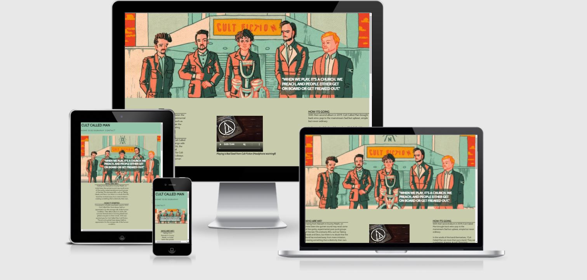

# Cult Called Man
My website [live here](https://excellentwish.github.io/first_html_css_ci_project/)

## Project Portfolio 1- HTML and CSS Essentials - Code Institute.
### Site Overview

The project will cover  my favorite music group.
Its aim is to highlight there music and social media presence.
The idea of the project is to showcase there music to fans and newbies while making it as user friendly as I can.
Cult Called Man an Irish retro pop rock group from Co.Meath Ireland and have a very unique sound fo them that is upbeat and melencholy.

# Table of Contents
+ [Site Overview](#site-overview)
+ [Planning stage](#planning-stage)
+ [Strategy](#strategy)
+ [Scope](#scope)
+ [Structure](#structure)
+ [Skeleton](#skeleton)
+ [Surface](#surface)
+ [Tech used](#tech-used)
+ [Testing](#testing)
+ [Deployment](#deployment)
+ [Credits](#credits)
+ [Acknowledgement](#acknowledgement)
   
# **Planning stage**
## Target Audiences:
* Users looking for new music from Ireland.
* Users with a general interest in Cult Called Man and want to learn more.
* Users who have never heard of Cult Called Man.
* Users who have heard of Cult Called Man but would like to find more information.

## User Experience
* As a site user, I want to be able to easily navigate through the site and find the information I am looking for. 
* As a site user, I want to be able to view the site on all my devices.
* As a site user, I want to be satisfied with the information provided.
* As a site user, I want to be able to find contact information.
* As a site user, I want to be able to find social media links easily.

## Site Aims:
* To educate the user on Cult Called Man's music.
* To offer the user a chance to listen to the band.
* To offer the user a way to contact the site author for further information or discussion.
* To offer a way to analyse which album is fans favorite.

## How Is This Will Be Achieved:
* The index page provides the user with a summary of the band, with a way to listen to the bands music and a way to contact them. I will also include a check box to find out which is there most popular album.

* The site will provide free ways to listen to there music with links to there bandcamp and spotify so users can listen to their music.

* The site will have information on the type of band this is and genre of music they play. It will have their music playing on the website with a video.

* The site will have links to their social media platforms

* The site will have a contact us form were users can find more information on the band.

## Wireframes
To organize my thoughts and prevent scope creep, I created wireframes for this project. Below are links to each of the mobile and desktop versions.
 * Desktop
 [Index html](docs/wireframes/index-wireframe.JPG)
 [Discography html](docs/wireframes/discography-wireframe.JPG)
 [Contact html](docs/wireframes/contact-us-wireframe.JPG)

* Mobile

# Strategy
 I want to have a place were fans and newbies can get all of the bands music in one place as they are found on different websites online. I want to tell people of my favorite Irish band and let them listen to them and if they wanted they can sign up for a gig guide that would be sent to there email.

I want to achieve an easy and convient place for people to find all of the bands music. I want to tell people of there music by having a discography, so the user can click and have there music. I will be using the bands bandcamp website, Spotify and Youtube. I will have there links to social media platforms

With the structure of the site. I will have it in one page for the convenience of the user. This will also be quicker then changing from differnt pages. I will lock the header with a navigation bar that will follow the user across the page so the user can navigate the page easily.

I will present the information by using pictures and video. This way the user can see the type of band they are listening too. I will be using the theme of there Cult Fiction album across the page as they are bright colours that contrast nicely and are easy to look at from a users perspective. Cult Fiction is also there most popular album so it may be recognisable to users who are fans of the band already.
LO1
Design a front-end web application based on the principles of user experience design,
accessibility and responsivity
LO2 Develop and implement a static front-end web application using HTML and CSS
LO3 Maximise future maintainability through documentation, code structure and organisation
LO4 Use version control software to maintain, upload and share code with other developers.
LO5 Test and deploy a front-end web application to a Cloud platform
#### Site Owners Goals 

# Scope
# Skeleton
# Structure
# Surface

--------------------------------------
---------------------------------------

# Tech used 
html ,css
Google fonts [cabin](https://fonts.google.com/specimen/Cabin?query=cabin)
font awsome [script for footer](https://fontawesome.com/kits/0f96215e04/use)
convert jpg to webp
-------------
---------------
## Testing section
Used a temporary red background-color in css to test my css links
issue with header h1 position - removed float left with chrome dev tools and added posisiton
Issue with nav links not going to top right of the page -
images in Discography differnt sizes - fix upload with same resolution
header nav would overlap discography- fix by adding margin and padding top
pictures not the right sizes chrome dev tools to adjust sizing of pic
media screen and max witdth creats a space in tablet view fix by adjusting width
lighthouse on mobile 86 changed css font import link to htim link 

-----------------------
-----------------------------
After what bugs there were and fixs
removed "/" from /assets/css/style.css to assets/css/style.css so git pages would work

Validator testing
Using [Validator W3](https://validator.w3.org/)
and CSS using [Jigsaw validator](https://jigsaw.w3.org/css-validator/)
-----------------------------------
-----------------------------
# Deployment
I deployed the page on GitHub pages via the following procedure: -

1. From the project's [repository](https://github.com/ExcellentWish/first_html_css_ci_project), go to the **Settings** tab.
2. From the left-hand menu, select the **Pages** tab.
3. Under the **Source** section, select the **Main** branch from the drop-down menu and click **Save**.
4. A message will be displayed to indicate a successful deployment to GitHub pages and provide the live link.

You  can find the live site via the following URL - [Cult Called Man](https://excellentwish.github.io/first_html_css_ci_project/)
-----------
-------------
# Credits 
Google fonts [cabin](https://fonts.google.com/specimen/Cabin?query=cabin)
[Font awesome](https://fontawesome.com/kits/0f96215e04/use)for social media
Love Running
css grid for images https://www.youtube.com/watch?v=rnhoY5Cdmy0 from dcode 
"content were code was found"  
"Media"
"Were pictures were found" 
Pictures from bandcamp website.

# Acknowledgement 

